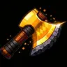

# ToporDrovosekaMS3



A Minecraft 1.21.1 (NeoForge) mod that recreates the ritual of crafting the **Woodcutter's Axe** — a special golden axe that originated on the MineShield 3 server.

## How It Works

Place the ingredients in a dispenser according to the layout below and send a redstone signal. The dispenser will consume all ingredients and eject the finished axe.

### Dispenser Layout (3×3)

```
[  empty  ] [ netherite ] [ netherite ]
[  Book U ] [ golden axe] [ netherite ]
[nether star] [  Book M  ] [  empty   ]
```

| Symbol | Item |
|--------|------|
| netherite | Block of Netherite |
| Book U | Enchanted Book — Unbreaking III |
| golden axe | Golden Axe (clean, unmodified) |
| nether star | Nether Star |
| Book M | Enchanted Book — Mending I |

### Result

A golden axe named **"Топор Дровосека"** — bold orange text, unbreakable.

## Configuration

File: `config/topordrovosekams3-common.toml`

**[general]**
- `enableMod` — enable/disable the mod (default: `true`)
- `minAxeDurability` — minimum remaining durability of the axe in the recipe, 0–31 (default: `31` — brand new axe only)

**[nbt_checks]** — controls which tags are forbidden on the golden axe in the recipe (all default to `true`):
- `requireNoEnchantments` — no enchantments
- `requireNoCustomName` — no custom name
- `requireNoLore` — no lore text
- `requireNoUnbreakable` — no Unbreakable tag
- `requireNoCanDestroy` — no CanDestroy tag
- `requireNoCanPlaceOn` — no CanPlaceOn tag
- `requireNoOtherTags` — no other custom tags

## Installation

1. Install [NeoForge 21.1.x](https://neoforged.net/) for Minecraft 1.21.1
2. Drop the JAR from `build/libs/` into your `mods/` folder

## License

[MIT](LICENSE) © 2026 Gavirchik